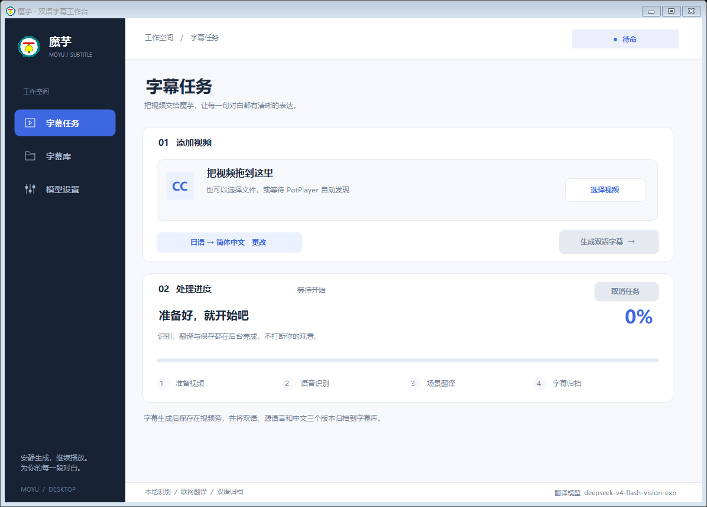

# 魔芋

“魔芋”是一个运行在 PotPlayer 进程之外的 AI 双语字幕工具。它负责检测正在播放的视频、提取或识别源语言字幕、调用模型整段翻译，并保存双语字幕和归档副本。

> 本仓库只包含“魔芋”自身的源代码、构建脚本和图标，不包含 PotPlayer、视频文件、用户字幕、API Key、识别模型或第三方可执行文件。



## 桌面工作台

- **字幕任务**：拖入单个视频或点击选择文件，查看当前任务、处理阶段、百分比与用时；可以随时取消。
- **字幕库**：浏览已配置目录中的归档，查看字幕文件数量和更新时间，双击打开归档目录。列表显示最近 100 个归档，不读取字幕正文；更多内容可直接打开字幕库目录。
- **模型设置**：集中配置翻译服务、源语言、字幕目录和后台行为。源语言不选择时默认日语；任务页可快速跳转修改。
- 窗口支持调整大小，内容较多时可滚动，设置页的保存和测试按钮始终固定在底部。
- 快捷键：`Ctrl+O` 选择视频；在设置页按 `Ctrl+S` 保存。关闭窗口仍保留后台运行，需要完全退出时使用托盘菜单的“退出”。

## 主要功能

- 打开 PotPlayer 后自动启动后台监控，发现新视频时在工具窗口内询问是否生成字幕。
- 视频可以正常播放，识别和翻译工作在独立进程中进行，不阻塞播放器。
- 可在“模型设置”选择源语言；不选择或使用旧配置时默认日语，翻译目标仍为简体中文。
- 优先读取所选语言的现有字幕，其次尝试对应语言的内嵌字幕，没有字幕时使用本地 Whisper。
- 先生成完整源语言字幕，再按场景调用兼容 OpenAI Chat Completions 格式的模型接口翻译。
- 默认模型为 `deepseek-v4-flash-vision-exp`，API 地址和模型名称可在界面中修改。
- API Key 只保存在 Windows 凭据管理器，不写入配置文件或日志。
- 使用内容指纹匹配缓存；视频改名或移动后仍能复用已完成字幕。
- 视频旁保存一份默认双语字幕；字幕库中同时保存双语、源语言和中文三个版本。
- 字幕加载交给 PotPlayer 自身，避免工具和播放器重复加载。
- 完成后只播放一次提示音，不使用 Windows 系统通知弹窗。

## 无托盘后台检测器

开启“模型设置 → 后台与隐私 → 使用 PotPlayer 时自动启动魔芋”并保存后：

- 当前用户登录 Windows 时只启动独立的 `Moyu-Watcher.exe`，而不是完整的魔芋。检测器没有窗口、控制台或托盘图标；仍可在任务管理器中正常看到并结束。
- 每秒检查一次当前 Windows 会话中的 PotPlayer 进程；发现新进程且魔芋未运行时，启动魔芋。魔芋随后检测视频并询问是否生成字幕，不会自动提交翻译。
- 魔芋从托盘菜单“退出”后，检测器继续工作，但不会因为同一个 PotPlayer 仍开着就立即把魔芋重新弹出来。下一个新 PotPlayer 进程可再次唤起魔芋；魔芋已运行时不重复启动或抢焦点。
- 取消勾选并保存，会同时移除登录启动项并停止检测器；退出魔芋本身不会关闭这个独立检测器。
- 检测的是**播放器进程启动**：完全退出魔芋后，仅在已打开的 PotPlayer 中切换视频不会重新唤起。单实例播放器的短暂转发进程也可能被一秒轮询漏过；这时可手动打开魔芋。
- 检测器只使用系统进程快照，不加载字幕引擎、WinForms 或 WMI，不修改播放器、不恢复插件、不启用系统审计，也不需要额外安装运行库。日志位于 `Logs/watcher.log`，只记录启动、停止和异常，并限制单份日志大小。

两个可执行文件需放在同一目录。旧的 `--wait-for-potplayer` 启动方式仍兼容，但现在只负责启动独立检测器后退出。手动运行 `Moyu-Watcher.exe --stop` 可临时停止检测器，不修改登录启动设置。

## 源语言设置

在“模型设置”的“源语言”下拉框选择语言，点击“保存设置”后对新提交的任务生效。支持日语（默认）、英语、韩语、中文、法语、德语、西班牙语、意大利语、葡萄牙语、俄语、泰语和越南语。已加入队列的任务保留提交时的语言，不受之后修改设置影响。

- 识别参数、内嵌字幕轨道筛选和翻译提示会一起使用所选语言。
- 外置字幕建议按语言标记命名，如 `视频名.en.srt` / `视频名.eng.srt`、`视频名.ko.srt` / `视频名.kor.srt`。非日语字幕不根据无语言标记的文件猜测语种；日语保留同名 `.srt` 的内容判断。
- 不同源语言的识别与翻译缓存分开保存，原有日语缓存仍可复用；视频旁由魔芋生成的旧语言字幕可更新，用户自有同名字幕仍受保护。

## 识别质量控制

- Whisper 分段识别时保留少量边界重叠，但每段清空文字上下文，降低幻觉连续扩散。
- 检测异常长时间轴、低信息文本、严重重复和时间轴重叠，并对问题区域进行有限次数的局部重识别。
- 识别结果先写入候选字幕和质量报告；严重错误未修复时不会替换正式字幕，也不会继续调用翻译接口。
- 分段结果带版本标记，模型、VAD、音频或原始结果变化时自动失效。

## 字幕保存规则

视频旁只生成：

```text
视频名.srt                 双语字幕，供 PotPlayer 自动发现
```

字幕库默认位于工具目录的 `hub`，结构如下：

```text
hub/
└─ 视频名字幕/
   ├─ 视频名-双语.srt
   ├─ 视频名-源语言.srt
   └─ 视频名-中文.srt
```

字幕库路径可以在“模型设置”中修改，保存后持久生效。

## 构建

系统要求：

- Windows 10 或 Windows 11
- .NET Framework 4.8
- PowerShell

运行：

```powershell
.\build.ps1
```

构建脚本使用 Windows 自带的 .NET Framework C# 编译器，输出 `AI-Subtitle-Worker.exe` 和 `Moyu-Watcher.exe`。程序对外显示名称为“魔芋”；保留该内部文件名是为了兼容现有启动项和缓存机制。

## 本地运行依赖

以下文件不进入 Git 仓库，需要在本地准备：

```text
Tools/ffmpeg.exe
Tools/Whisper/Vulkan/whisper-cli.exe
Tools/Whisper/Models/ggml-silero-v6.2.0.bin
Whisper 主识别模型
```

首次运行后，程序会自动创建并维护以下本地目录，它们也不会提交到仓库：

```text
Config/    非敏感设置和运行状态
Cache/     内容指纹缓存、识别断点和质量报告
Queue/     临时任务
Logs/      运行日志
hub/       用户字幕库
```

API Key 通过界面的“模型设置”页写入 Windows 凭据管理器。请勿把密钥写进源码或 `settings.json`。

## 源码结构

```text
Assets/Moyu.ico             程序图标（窗口与托盘）
Assets/Brand/               品牌素材源图（Hero、Logo），由构建脚本内嵌
src/MainForm.cs             主窗口与交互逻辑
src/MainForm.Layout.cs      工作台/设置页面布局
src/MainForm.Chrome.cs      一体化自绘标题栏、窗口按钮与 DPI/圆角处理
src/MainForm.Library.cs     字幕库页面
src/MoyuTheme.cs            主题色、通用绘制与自绘控件
src/MoyuArtwork.cs          品牌插画与主视觉
src/MoyuSurface.cs          纸张/印刷纹理与动画
src/MoyuTypography.cs       字体选择与字号层级
src/PotPlayerMonitor.cs     魔芋运行时的视频检测
src/StartupManager.cs       检测器启停与当前用户登录启动项
src/WatcherContract.cs      主程序与检测器共用的命名约定
watcher/                   独立、无窗口、无托盘的轻量进程检测器
src/Recognition.cs          音频提取与 Whisper 识别
src/SourceLanguages.cs      源语言选项与缓存隔离
src/SubtitleQuality.cs      字幕质量检测和修复
src/DeepSeek.cs             模型请求
src/Pipeline.cs             完整处理流程
src/SubtitlePublisher.cs    字幕发布与归档
build.ps1                   构建脚本
```
## 界面回归测试

运行 `tests/run-ui-tests.ps1`，在临时目录编译独立测试程序，检查导航、拖放规则、任务状态、源语言设置、字幕库、最小窗口布局，以及原生标题栏命中/缩放/最大化、动画、纹理确定性和双缓冲等，并保存实际窗口截图。测试不启动识别任务、联网翻译、播放器监控或开机启动项，也不修改用户配置与字幕库。

## 后台检测器回归测试

```powershell
.\tests\run-watcher-tests.ps1
```

在独立临时目录中编译检测器与模拟播放器/主程序，验证真实进程快照、唤起、主程序退出、新播放器再次唤起、单实例和停止/重启；另外验证失败重试、PID 复用和启动命令。仅在测试副本中替换进程名与主程序互斥量，不修改生产注册表、播放器或正在运行的魔芋。

可使用 `./build.ps1 -OutputDirectory <目录>` 先构建到暂存目录，避免覆盖正在运行的程序。

## 翻译道具箱视觉主题

正式窗口已采用蓝黄漫画风“翻译道具箱”：厚切魔芋插画、米白底纸、墨线控件，以及处理中收起插画的紧凑布局。仍为原生 WinForms，不需要浏览器运行时。品牌素材源图位于 `Assets/Brand/`，高清 PNG 由构建脚本内嵌。

- **一体化标题栏**：48px 自绘标题栏，蓝色侧栏通顶，右侧为自绘的最小化/最大化/关闭按钮；可在标题栏任意空白处拖动窗口，双击标题栏可最大化/还原。
- **圆角窗口**：在 Windows 11 上采用系统原生圆角，最大化时自动回归直角；Windows 10 不提供该圆角能力。
- **高 DPI 清晰**：程序声明 DPI 感知，自绘文字按设备像素以点字号（ClearType）渲染，175% 缩放下中文清晰不发虚。
- **字体与细节**：优先使用 Noto Sans SC（缺失时回退微软雅黑），主标题 34px、页标题 25px、卡片标题 16px、正文 14–15px。上传卡片带纸胶带，侧栏底部为描边小魔芋线稿与播放器连线（不拦截鼠标、对辅助技术隐藏）。
- **性能**：纸张/印刷纹理采用“预缩放贴片 + 整数平移”，避免高 DPI 下逐像素重采样；纹理画刷复用、窗口双缓冲，页面切换流畅。

原生窗口截图与验证说明见 `docs/design/native/`；`docs/design/v2/`、`docs/design/v3-typography/`、`docs/design/v4-space-decor/` 保留的是设计稿与历史迭代，不是生产任务界面。
